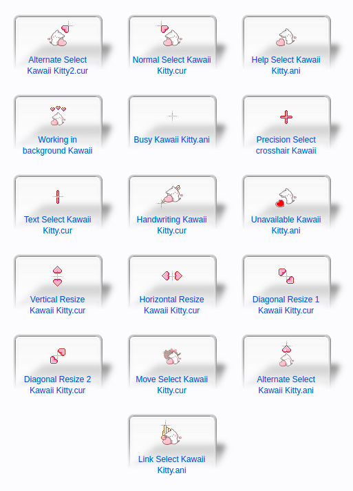
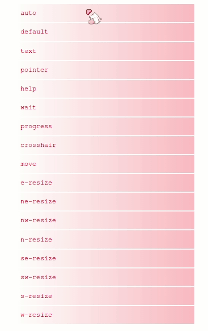

### Kawaii Kitty Cat kitten Cursor Set (but for ubuntu (◕‿◕✿))

Installation:
1. Download this cursor set.
2. Extract into /usr/share/icons
3. Use gnome-tweak-tool to set this pack to your gnome.

Tested on Ubuntu 20.04.4 LTS.

### More info
=== Kawaii Kitty Cat kitten Cursor Set ===

By: ツ Mimi Destino ♡ (http://www.rw-designer.com/user/38152)

Download: http://www.rw-designer.com/cursor-set/kawaiikittymd

Author's description:

  
  
ツ MIMI DESTINO ♥.♡

Enjoy the set.
Thanks for download and review ✫✫✫✫✫

--

How to install? 
https://youtu.be/VOr3HZHS4fQ

Como instalarlos?
https://youtu.be/EGx6plXI0Yc

Have any cursor requests? feel free to comment on my profile!

Black Heart
http://www.rw-designer.com/cursor-set/kawaiibhkittymd

 

==========

License: Creative Commons - Attribution + Noncommercial

You are free:

* To Share - To copy, distribute and transmit the work.
* To Remix - To adapt the work.

Under the following conditions:

* Attribution - You must attribute the work in the manner specified
  by the author or licensor (but not in any way that suggests that
  they endorse you or your use of the work). For example, if you are
  making the work available on the Internet, you must link to the
  original source.
* Noncommercial - You may not use this work for commercial purposes.
